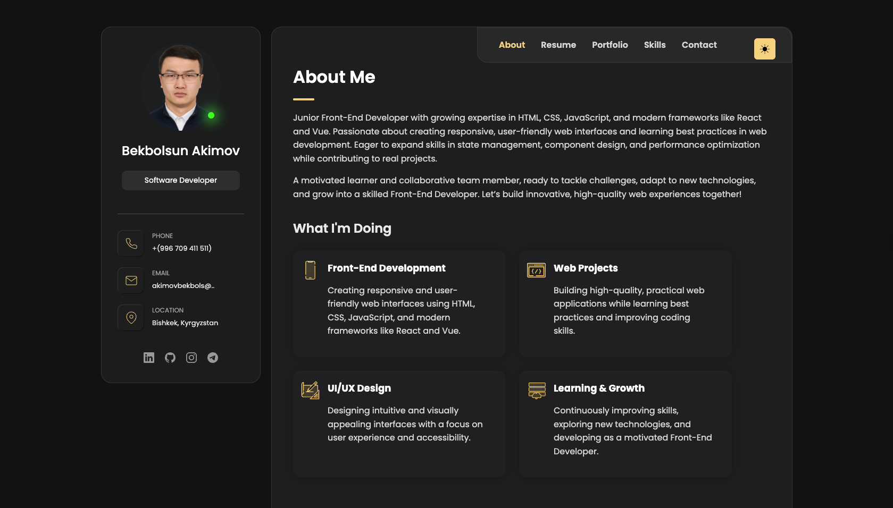
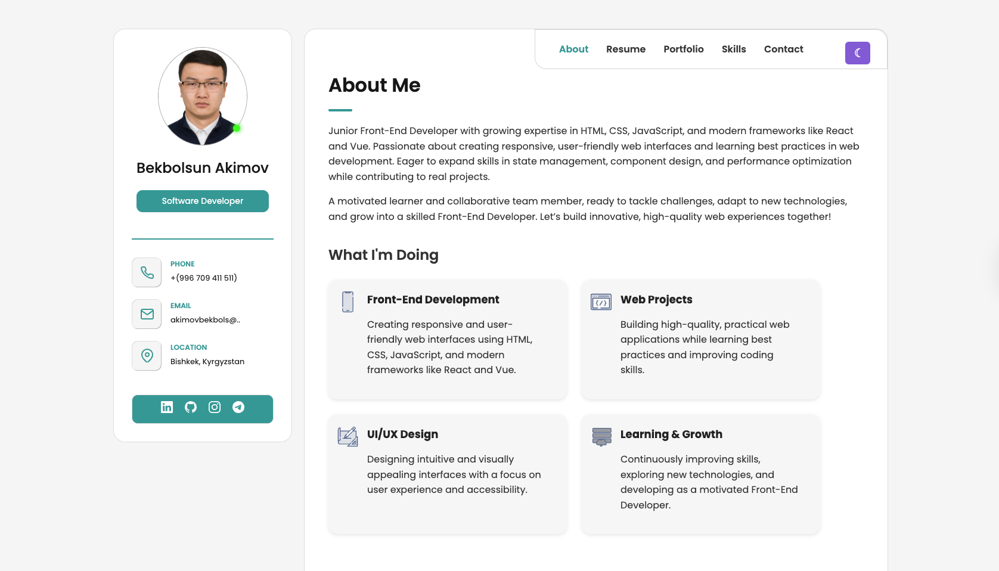
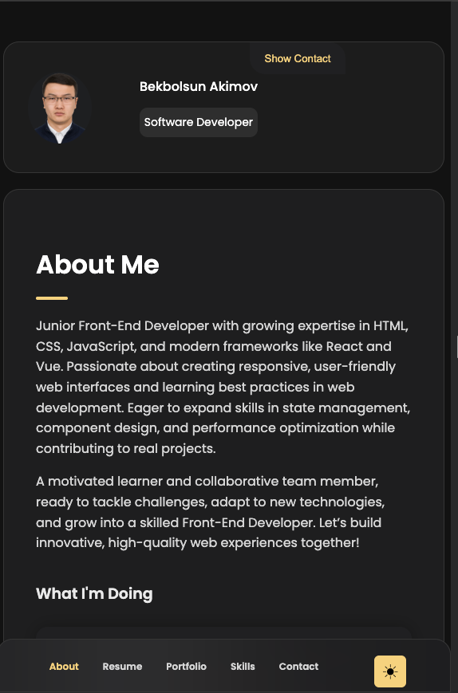

# 💻 Bekbolsun Akimov — Personal Portfolio

Welcome to my personal portfolio! I'm a Junior Front-End Developer passionate about building responsive, user-friendly web interfaces.

## 🚀 Live Demo

[View Portfolio](https://softengx.github.io/portfolio/)

## 📌 Features

- Single Page Application (SPA)
- Dynamic section switching with JavaScript
- Responsive layout
- Dark/light theme toggle
- Modal avatar preview

## 🛠️ Tech Stack

Used in this project:
- HTML5
- CSS3
- JavaScript (Vanilla)

Other technologies I work with:
- React
- TypeScript
- Vue.js
- Figma

## 📸 Screenshots

### 🧑‍💻 About Section

### 🧑‍💻 About light Section

### 🧑‍💻 Mobile View

## 👨‍💻 Author

**Bekbolsun Akimov**  
📍 Bishkek, Kyrgyzstan
🔗 [GitHub](https://github.com/SoftEngX)
📧 akimovbekbolsun332 [at] gmail [dot] com